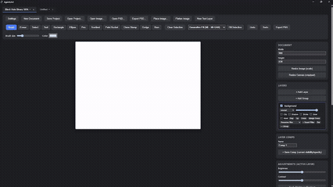

# AgenticArt

### 🤖 Made by agents, for agents.

**A real, Photoshop-caliber image editor that AI agents drive with the same
precision as a human — down to the individual brush stroke — live, in a
canvas a person can watch and paint alongside.**

Not a wrapper around a diffusion API. Not "describe what you want and hope."
AgenticArt exposes the *actual tools* — brushes, layers, selections, masks,
adjustments, generative fill — over MCP, so an agent can reproduce a
reference photo one stroke at a time, paint an original illustration from
scratch, or edit a real project file with pixel-level control. Everything an
agent does shows up **instantly** in the desktop app, live, whether a human
is watching or not.

<p align="center">
  
</p>

<p align="center"><i>Above: not a filter. An agent sampled real pixel colors from a source photo and painted this from ~97,000 individual brush strokes, live, through the MCP API — no generative model involved.</i></p>

<p align="center">
  
</p>

<p align="center"><a href="media/blackhole-timelapse.mp4">Full-quality video (.mp4)</a></p>

<p align="center"><i>A 500,000-stroke illustration being painted live by an agent, streamed straight into the open desktop window.</i></p>

---

## What makes this different

Every other "AI image tool" hands you a black box: prompt in, pixels out.
AgenticArt instead hands an agent the same toolbox a human illustrator has —
and the same live document, so a human and any number of agents can work on
one canvas together, watch each other's edits land in real time, and undo
each other's mistakes.

- **Stroke-level control, not just prompts.** `paint.strokePath` takes real
  point paths with pressure and brush parameters — an agent can trace a
  reference image, block in color like a painter, or hand-paint an entirely
  original illustration. Generative fill exists too, but it's an option, not
  the only path.
- **One shared, live document.** The desktop app embeds the same MCP server
  an external agent connects to. There's no "agent's copy" vs. "your copy" —
  it's the same in-memory document, the same undo stack, updated instantly
  in both directions the moment anything changes.
- **A human never has to babysit it.** A settings screen manages the agent
  connection (persistent token, one-click rotation, ready-to-paste config
  for Codex/Claude Code/any MCP client). Tabs for every open document. An
  agent can even call `document.focus` to bring a specific canvas to the
  front of the window.
- **Real editing depth, not a toy.** Layers, groups, masks, layer styles,
  non-destructive smart filters, live text, true 4-point perspective, a real
  PSD reader/writer, RAW import, CMYK/16-bit color, and both a classical
  PDE-based content-aware fill and a real ML inpainting model (MI-GAN) for
  generative fill — MIT-licensed, verified, and bundled.

## Feature highlights

**Painting & retouching** — brush, eraser, clone stamp, healing brush,
dodge/burn, paint bucket, gradients (linear & radial), the pen tool with
Bezier fill/stroke.

**Layers, non-destructively** — groups, clipping masks, raster masks from
a selection, layer comps, drop shadow/stroke/outer glow/bevel-emboss styles,
a reorderable smart-filter stack, merge-down/flatten.

**Adjustments & filters** — brightness/contrast, hue/saturation, Gaussian
blur, sharpen, CMYK soft-proofing, ICC-style color profile conversion,
16-bit export.

**AI-native, by design** — subject segmentation & cutout (ONNX, local),
classical content-aware fill *and* real GAN-based inpainting (MI-GAN), both
exposed identically to the classic tools.

**Text & transform** — live, re-editable text layers (not baked-in raster),
move/rotate/scale/skew, true projective 4-corner perspective, a minimal
honest 3D-plane transform.

**File formats** — a native lossless project format, real layered PSD
import/export, RAW (Bayer) import, PNG/JPEG, high-bit-depth export.

**Automation** — named, replayable macros and batch processing over a
folder of files, built on the exact same operations an agent calls.

**Built for multiple agents at once** — job handles so a slow op never
blocks a connection, scoped bearer tokens (read-only, or locked to one
document), and a live document store several agents and a human can all
have open simultaneously.

**A plugin SDK** — third-party filters run sandboxed in WASM (`wasmtime`),
so a plugin can't destabilize the host app.

## Quickstart

Requires Rust (stable) and, on Windows, the MSVC C++ build tools, plus
Node.js for the desktop app's frontend.

```bash
cargo build --workspace
```

**Run the desktop app** (this is where the magic happens — it embeds a live
MCP server so any agent you connect gets the exact canvas you're looking
at):

```bash
cd apps/desktop
npm install
npm run tauri build   # or `npm run tauri dev` for a dev build
```

Launch the built app, open **Settings**, and you'll see the live MCP server
URL and bearer token — copy the ready-made config snippet straight into
Codex, Claude Code, or any other MCP-capable client.

**Prefer a headless agent with its own isolated document store?** Run the
MCP server standalone instead:

```bash
cargo run -p agenticart-mcp-server                                   # stdio
cargo run -p agenticart-mcp-server -- --http-port 8137 --token <t>   # HTTP
```

The HTTP transport binds to `127.0.0.1` only — front it with a tunnel
(`cloudflared`, Tailscale Funnel) to reach it from another machine.

**See it in action** — an agent opens a reference image it's never seen the
construction of, reads the raw pixels over MCP, and reproduces it in a
brand-new document using nothing but `paint.strokePath` (no generative fill
involved):

```bash
node examples/agent_reproduce_demo.mjs
```

## Talking to it over MCP

```bash
curl -X POST http://127.0.0.1:9223/mcp \
  -H "Authorization: Bearer <your-token>" \
  -H "Content-Type: application/json" \
  -d '{"jsonrpc":"2.0","id":1,"method":"tools/list","params":{}}'
```

Or over stdio, newline-delimited JSON-RPC:

```json
{"jsonrpc":"2.0","id":1,"method":"initialize","params":{}}
{"jsonrpc":"2.0","id":2,"method":"tools/list","params":{}}
{"jsonrpc":"2.0","id":3,"method":"tools/call","params":{"name":"document.create","arguments":{"width":512,"height":512}}}
```

Well over 100 tools are on the menu — `document.*`, `layer.*`, `paint.*`,
`selection.*`, `mask.*`, `adjustment.*`, `filter.*`, `generative.*`,
`ai.*`, `text.*`, `transform.*`, `canvas.*`, `history.*`, `automation.*`,
`job.*` — call `tools/list` and see for yourself.

## License

MIT.
